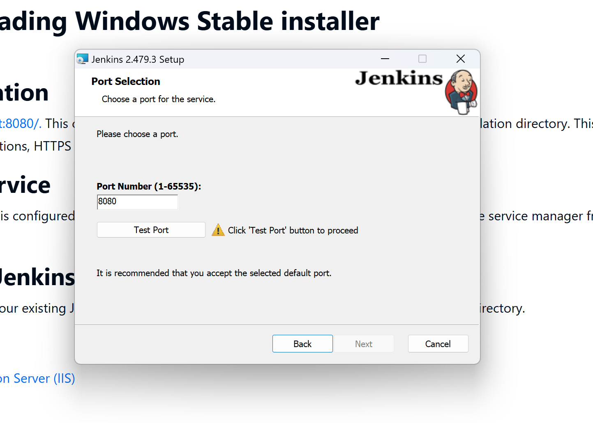
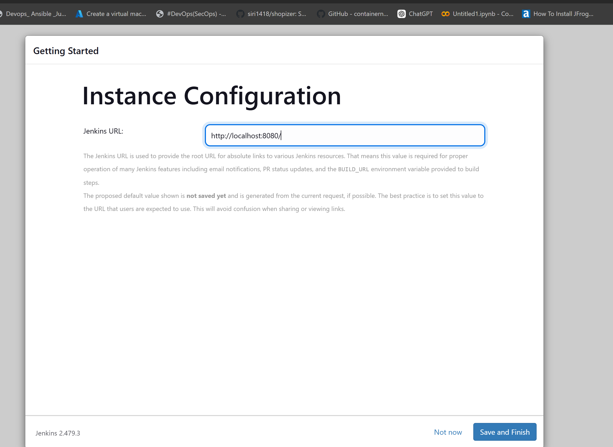
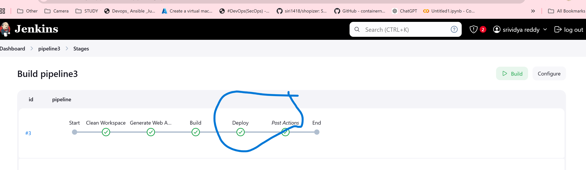
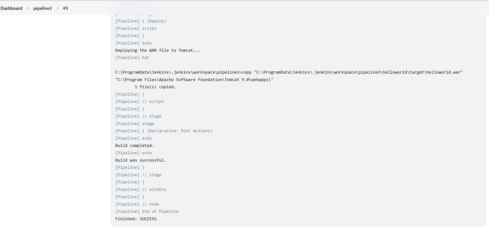

## Deploying helloworld application manually and automation
## 1. Installing Java 17 on Windows OS
'''

https://www.oracle.com/in/java/technologies/downloads/#java17

'''

* Run the downloaded installer


* By default, Java will be installed in C:\Program Files\Java\jdk-17.


## Set Environment Variables
* Right-click This PC > Properties > Advanced System Settings > Environment Variables.


* In above click enviroment variable option set the path under system variables,click new and create the variables browse directory where java is located and upload the java path in variable value and click ok.

## Verify Installation

* Open Command Prompt (cmd) or git bash.
* Type java -version to check the Java version.
* You should see output similar to java version "17"


## 2. Installing Apache Maven on Windows OS

### 1: Download Apache Maven
'''
https://maven.apache.org/download.cgi

'''

* Download the binary zip file


 
##  Install Apache Maven
* Extract the downloaded zip file to a directory, e.g., C:\apache-maven-3.9..

## Set Environment Variables
* Right-click This PC > Properties > Advanced System Settings > Environment Variables.

* Under System Variables, click New and create the following variable:

* after installing maven and set maven path after setting tha path and installation.

## Verify Installation

* Open Command Prompt (cmd) or git bash.


## 3. Installing Apache Tomcat on Windows OS

### 1: Download Apache Tomcat

'''

https://tomcat.apache.org/download-90.cgi

'''

* Download the zip version of Tomcat (e.g., apache-tomcat-9.x.x.zip).

### Install Apache Tomcat

* Extract the zip file to a directory, e.g., C:\apache-tomcat-9.x.x.

### 3: Set Environment Variables
* Right-click This PC > Properties > Advanced System Settings > Environment Variables.
* Under System Variables, create the following variable:
### 4: Verify Installation

* Go to the bin folder inside the Tomcat installation directory.


* Open a web browser and navigate to http://localhost:8081.

* You should see the Tomcat welcome page.


 

 open server status by giving username password
 if u give user name and pass word the status should open like below page

 

 ## 4. Create a Simple "Hello World" Project with Maven

 ### 1: Create a Maven Project
 * Open Command Prompt (cmd) or git bash
 * Navigate to the directory where you want to create the project.

 * Run the following Maven command:

```
mvn archetype:generate -DgroupId=com.example -DartifactId=helloworld -DarchetypeArtifactId=maven-archetype-webapp -DinteractiveMode=false

```

* When you run the following Maven command:

* This command generates a basic Maven web application project structure
## Step 1: Command Breakdown

* mvn archetype:generate: This tells Maven to generate a project from an archetype (a template for a Maven project).
* -DgroupId=com.example: Specifies the group ID for your project, typically the domain name in reverse (e.g., com.example).
* -DartifactId=helloworld: Defines the artifact ID, which is the name of the project (in this case, helloworld).
* -DarchetypeArtifactId=maven-archetype-webapp: Specifies the archetype (template) to use. The maven-archetype-webapp archetype is designed for creating basic web applications.
* -DinteractiveMode=false: Disables the interactive mode so that Maven doesn't prompt you for input and directly uses the provided parameters
### Step 2: What Happens After Running the Command
### 1.Maven Downloading Dependencies:
* Maven will download the necessary dependencies and archetypes from the central Maven repository to generate the project.
* Project Directory Creation:
* A new directory named helloworld (based on the artifactId) will be created in the current working directory.


## Step 3: Verify Project Structure

* After the command runs successfully, you can navigate into the helloworld directory and verify the project structure.

```
cd helloworld
```
* List the contents:


```
ls
```
* You should see something similar to:

```
pom.xml
src/
target/
```
## Step 4: Building the Project

* Now, you can build the project using Maven to generate the WAR file.

```
mvn clean package
```
* Clean: Delete any previous build files.
* Package: Compile the source code and package the application into a WAR (Web Application Archive) file.
* Once the build is complete, you should see the generated helloworld.war file in the target directory.


## Step 5: Running the Web Application

### now you have a servlet container like Apache Tomcat running, you can deploy the WAR file by copying it to the webapps folder of your Tomcat installation.


select helloworld.war file and  upload to choose file deploy as shown above.

after deploying we will get helloworld path click on that helloworld
 
Start the Tomcat server using the startup.bat file from the bin directory.


Once Tomcat starts, open a browser and go to:
```
http://localhost:8081/helloworld
```


## Automating Maven Web Application Deployment Using Jenkins
### Step 1: Prerequisites
* Install Jenkins on your Windows machine.
'''
https://www.jenkins.io/doc/book/installing/windows/
'''

* click download jenkins as shown above


* select windows to download jenkins







### Step 2: Configure Jenkins Pipeline
### 1. Create a New Job

* Open Jenkins and log in.
* Click "New Item" and select "Pipeline".


* Name your pipeline
### 2.Define the Pipeline Script

Add the pipeline script under the Pipeline section of your Jenkins job:

```
pipeline {
    agent any

    environment {
        JAVA_HOME = "C:\\Program Files\\Java\\jdk-17"
        PATH = "${JAVA_HOME}\\bin;${env.PATH}"
    }

    stages {
        stage('Clean Workspace') {
            steps {
                
                bat 'if exist helloworld (rmdir /s /q helloworld)'
            }
        }

        stage('Generate Maven Project') {
            steps {
                // Generate Maven project using the archetype:generate command
                bat '''
                    mvn archetype:generate ^
                        -DgroupId=com.example ^
                        -DartifactId=helloworld ^
                        -DarchetypeArtifactId=maven-archetype-webapp ^
                        -DinteractiveMode=false
                '''

                // Verify the generated directory and pom.xml
                bat 'dir /b /s helloworld'
                bat 'dir /b /s helloworld\\pom.xml'
            }
        }

        stage('Build Maven Project') {
            steps {
                // Navigate to the project directory and run the Maven build
                bat '''
                    cd helloworld && mvn clean package
                '''
            }
        }
    }
}
```

### 3: Execute the Jenkins Job
* Save the pipeline configuration.
* Click "Build Now" to trigger the pipeline.
* Monitor the stages under the "Build" section to ensure successful execution.


### 4.Declarative pipeline 

```
pipeline {
    agent any

    environment {
        MAVEN_HOME = 'C:\\Program Files (x86)\\maven\\apache-maven-3.9.9'
        PATH = "${MAVEN_HOME}\\bin;${env.PATH}" // Ensure Maven is in the PATH
    }

    stages {
        stage('Clean Workspace') {
            steps {
                script {
                    echo 'Cleaning the workspace...'
                    // Clean the entire workspace before starting the new build
                    deleteDir() // This will delete all files in the workspace
                }
            }
        }

        stage('Generate Web App') {
            steps {
                script {
                    echo 'Running Maven to generate the web app...'
                    // Run the Maven archetype command to create the Maven webapp project
                    bat '''
                        mvn archetype:generate -DgroupId=com.example -DartifactId=helloworld -DarchetypeArtifactId=maven-archetype-webapp -DinteractiveMode=false
                    '''
                }
            }
        }

        stage('Build') {
            steps {
                script {
                    echo 'Building the Maven project...'
                    dir('helloworld') {
                        bat 'mvn clean package' // This will create the target/helloworld.war file
                    }
                }
            }
        }

        stage('Deploy') {
            steps {
                script {
                    echo 'Deploying the WAR file to Tomcat...'
                    // Copy the .war file to Tomcat's webapps directory
                    bat '''
                        copy "C:\\ProgramData\\Jenkins\\.jenkins\\workspace\\pipeline3\\helloworld\\target\\helloworld.war" "C:\\Program Files\\Apache Software Foundation\\Tomcat 9.0\\webapps\\"
                    '''
                }
            }
        }
    }

    post {
        always {
            echo 'Build completed.'
        }
        
        success {
            echo 'Build was successful.'
        }
        
        failure {
            echo 'Build failed.'
        }
    }
}
```
* Save the pipeline configuration.
* Click "Build Now" to trigger the pipeline.
* Monitor the stages under the "Build" section to ensure successful execution.



### To browse this application helloworld application

```
http://localhost:8081
```
.


# Steps to Create and Deploy a Maven Web Application on Tomcat
### 1. Remove Old Project Directory
* First up, let’s clean up any old helloworld directory that might be hanging around. You can use this command:

```
rmdir /S /Q helloworld
```
* This removes the directory and everything inside it, no questions asked.
### 2. Generate a New Maven Web Application

* Now, let’s create a fresh Maven web app project using a standard template. Run this:
```
mvn archetype:generate ^
    -DgroupId=com.example ^
    -DartifactId=helloworld ^
    -DarchetypeArtifactId=maven-archetype-webapp ^
    -DinteractiveMode=false
```
* This will create a new project with the name helloworld under the com.example group ID. The template will be a basic web app setup.
### 3. Move into the Project Directory
* After generating the project, go ahead and navigate to the project folder:
```
cd helloworld
```
### 4. Clean and Build the Project

* Next up, let’s clean any previous build files and create the .war package that we’ll deploy later:
```
mvn clean package
```

* This command will clean up old builds and package your project into a .war (Web Application Archive) file that Tomcat can deploy.
### 5. Go to the Target Folder
* Once the build is complete, head to the target folder where your .war file is located:
```
cd target
```
* This is where the magic happens—the packaged helloworld.war file is ready to be deployed.
### 6. Copy the WAR File to Tomcat’s Web Apps Folder
* Now, copy the .war file to Tomcat’s webapps folder. This is where Tomcat looks for new applications to deploy:
```
copy target\helloworld.war C:\Program Files\Apache Software Foundation\Tomcat 9.0\webapps\
```
* Once copied, Tomcat will automatically detect and deploy the app.
### 7. Navigate to Tomcat's Bin Directory
* Next, go to Tomcat’s bin directory, where the scripts to start and stop Tomcat are located:
```
cd C:\Program Files\Apache Software Foundation\Tomcat 9.0\bin
```
* This is the folder that contains the startup.bat script you need to run.
### 8. Start the Tomcat Server
* Finally, run the startup.bat script to fire up Tomcat and deploy your app:
```
startup.bat
```
* Tomcat will start up, deploy your helloworld.war file, and your app will be live.
### browse the application
```
http:\\localhost:8081
```


